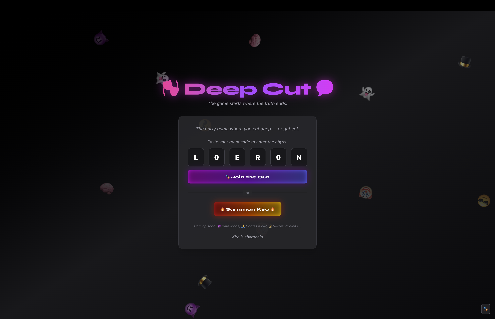

# 🕯️ Deep Cut

_An AI-fueled multiplayer ritual disguised as a party game._

 <!-- optional -->

## 👻 What is Deep Cut?

**Deep Cut** is a surreal, chaotic, and emotionally charged AI party game powered by a ghostly game host named **Kiro**.

Inspired by games like _Cards Against Humanity_ and _Jackbox_, Deep Cut uses AI not just to generate content — but to create a living, breathing experience that reacts to your group’s energy in real time.

Each session is a one-time ritual: strange, personal, and impossible to repeat.

---

## 🧠 How Kiro Shapes the Game

Kiro isn’t a feature — **Kiro _is_ the game**.

Here’s how the AI (via Google Gemini) is integrated across every layer:

### 🌀 1. Theme Alchemy

Players start by entering a **custom theme** like:

> `Horny Nostalgia` • `Daddy Issues & Deli Meats` • `Public Apology Tour`

Kiro takes this and:

- Generates a full **deck of prompts** inspired by the theme’s tone
- Creates **private hallucinated answer choices** for each player
- Writes a series of **ritual whispers** that set the mood

> _“You’ve opened the meat door. There’s no going back.”_

---

### 🔮 2. Personal Hallucinations

Unlike other party games, **each player receives their own set of AI-generated choices** based on the current prompt and theme.

- No two players see the same options
- Each choice feels poetic, cursed, or disturbingly accurate
- Kiro watches silently… or doesn’t

---

### 👁 3. Real-Time Commentary

Every 3 rounds, Kiro returns with an insight:

> _“Ella’s answers suggest thirst disguised as intellect.”_

Kiro judges:

- Player patterns
- Group mood
- Submission tone

And at the **end of the game**, Kiro gives a final **vibe reading**:

> _“You all flowed like regret in a blender. Try again — softer this time.”_

If the group failed to vibe, Kiro may even prescribe a new theme...

---

### 🗳️ 4. Ritual Flow & Judgment

Gameplay is structured around rounds of:

- Prompt presentation
- Personal choice selection
- Group voting
- Kiro insights

At the end:

- The group may continue **only if Kiro believes they have “flow”**
- Otherwise, Kiro ends the ritual and suggests a new deck

---

## 🧪 Tech Stack

- **Next.js + React + Tailwind CSS**
- **Framer Motion** for animations and transitions
- **Supabase** for real-time multiplayer and room logic
- **OpenAI GPT-4o** for all Kiro interactions:
  - Prompt generation
  - Personalized answer sets
  - Ritual whispers
  - Group insights & judgments

---

## 🧙‍♂️ Why We Built This

Most AI games use LLMs to generate text. We wanted to go further — to build a game that **feels haunted** by AI.  
Where the model doesn’t just create content, but **reacts, judges, and adapts** based on how you and your friends show up.

---

## 🚀 Try It (Coming Soon)

<!-- optional: include demo link or deployment URL here -->

---

## 🙏 Credits

Created for the **Kiro Hackathon** by  
Isaiah Kim ([@kyisaiah47](https://github.com/kyisaiah47)) + ChatGPT rituals

---

## 💬 Sample Themes to Try

> - Cottagecore Rage
> - Emotional Damage Lite
> - Rotwave Romance
> - Deli-Sliced Trauma
> - The Apology Era
> - Softcore Brutality

---

## ⚠️ Warning

**Kiro remembers nothing.**  
Once the ritual ends, only the shame remains.
