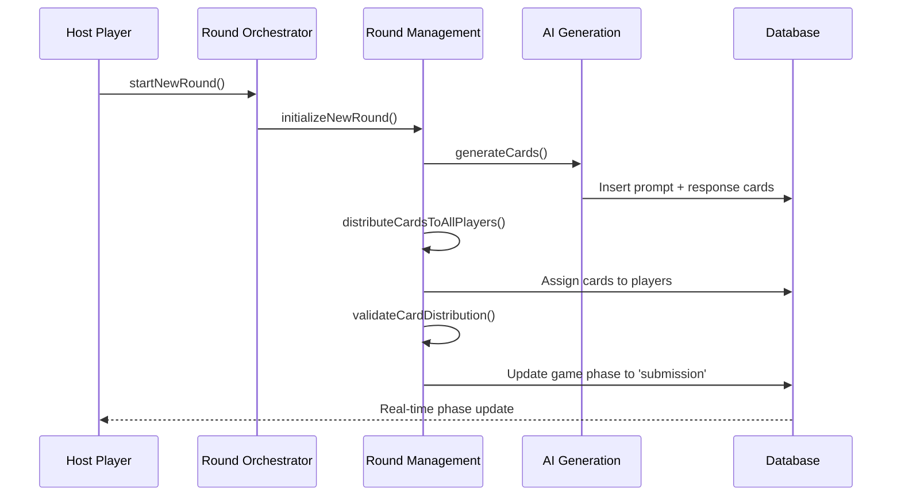

# Round Management System

This document describes the implementation of the round management and card distribution system for the AI Cards Against Humanity game.

## Overview

The round management system handles the complete lifecycle of a game round, from initialization through card distribution to phase transitions. It ensures that all players receive cards before the submission phase begins and manages the automatic progression through game phases.

## Architecture

### Core Components

1. **useRoundManagement** - Low-level hook for round operations
2. **useRoundOrchestrator** - High-level orchestration and coordination
3. **useGameActions** - Integration with game actions and UI
4. **RoundManager** - UI component for round status and controls

### Key Features

- **AI Card Generation**: Generates prompt and response cards using AI with fallback system
- **Card Distribution**: Ensures each player gets unique response cards (5 per player)
- **Phase Validation**: Validates transitions between game phases
- **Real-time Updates**: Synchronizes round state across all connected clients
- **Error Handling**: Graceful handling of AI failures and network issues

## Implementation Details

### Round Initialization Flow



### Phase Transitions

The system enforces strict phase transition rules:

- **Lobby → Distribution**: Game start (host only, min 3 players)
- **Distribution → Submission**: Cards distributed and validated
- **Submission → Voting**: All players have submitted
- **Voting → Results**: Voting complete
- **Results → Distribution**: Next round start

### Card Distribution Algorithm

1. **Generate Cards**: Create 1 prompt + sufficient response cards
2. **Shuffle**: Randomize response card order
3. **Distribute**: Assign 5 cards to each connected player
4. **Validate**: Ensure all players have exactly 5 cards
5. **Progress**: Automatically transition to submission phase

## API Reference

### useRoundManagement

```typescript
interface RoundManagementHook {
	// State
	isInitializingRound: boolean;
	isDistributingCards: boolean;
	roundError: GameError | null;
	cardsDistributed: boolean;
	allPlayersHaveCards: boolean;

	// Actions
	initializeNewRound: () => Promise<void>;
	distributeCardsToAllPlayers: () => Promise<void>;
	validateCardDistribution: () => Promise<boolean>;
	progressToSubmissionPhase: () => Promise<void>;
	resetRoundState: () => void;

	// Computed values
	canStartRound: boolean;
	canDistributeCards: boolean;
	canProgressToSubmission: boolean;
}
```

### useRoundOrchestrator

```typescript
interface RoundOrchestratorHook {
	// State
	currentRoundNumber: number;
	isRoundInProgress: boolean;
	roundPhase: "initializing" | "distributing" | "ready" | "complete" | null;
	roundError: GameError | null;

	// Actions
	startNewRound: () => Promise<void>;
	handlePhaseTransition: (newPhase: GameState["phase"]) => Promise<void>;
	handleDistributionPhase: () => Promise<void>;
	resetRound: () => void;

	// Status
	canStartNewRound: boolean;
	isDistributionPhase: boolean;
	isSubmissionReady: boolean;
}
```

## Usage Examples

### Starting a New Round (Host)

```typescript
import { useGameActions } from "@/hooks";

function GameComponent() {
	const { startNewRound, canStartNewRound, roundPhase } = useGameActions();

	const handleStartRound = async () => {
		if (canStartNewRound) {
			try {
				await startNewRound();
			} catch (error) {
				console.error("Failed to start round:", error);
			}
		}
	};

	return (
		<button
			onClick={handleStartRound}
			disabled={!canStartNewRound}
		>
			{roundPhase === "initializing" ? "Generating Cards..." : "Start Round"}
		</button>
	);
}
```

### Monitoring Round Progress

```typescript
import { useGame, useGameActions } from "@/hooks";

function RoundStatus() {
	const { gameState, currentRoundCards } = useGame();
	const { roundPhase, isRoundInProgress } = useGameActions();

	return (
		<div>
			<h3>Round {gameState?.current_round}</h3>
			<p>Phase: {gameState?.phase}</p>
			<p>Cards: {currentRoundCards.length}</p>
			{isRoundInProgress && <p>Status: {roundPhase}</p>}
		</div>
	);
}
```

## Error Handling

The system includes comprehensive error handling:

### AI Generation Failures

- Automatic fallback to pre-written cards
- User notification of fallback usage
- Retry mechanisms for temporary failures

### Network Issues

- Automatic reconnection attempts
- State synchronization recovery
- Graceful degradation

### Validation Errors

- Card distribution validation
- Player count verification
- Phase transition validation

## Testing

### Unit Tests

Run logic validation tests:

```bash
node scripts/test-round-logic.js
```

### Integration Tests

Run full round management tests (requires Supabase setup):

```bash
node scripts/test-round-management.js
```

## Configuration

### Game Settings

- `cardsPerPlayer`: Number of response cards per player (default: 5)
- `minPlayers`: Minimum players to start round (default: 3)
- `maxPlayers`: Maximum players per game (default: 8)

### AI Generation

- Fallback system activates on AI failures
- Content moderation for generated cards
- Caching for improved performance

## Performance Considerations

### Optimization Strategies

- **Card Caching**: Cache generated cards for similar prompts
- **Batch Operations**: Minimize database round trips
- **Real-time Efficiency**: Selective subscriptions and updates
- **Memory Management**: Proper cleanup of subscriptions

### Scalability

- Supports up to 8 players per game
- Efficient card distribution algorithm
- Minimal database queries during distribution

## Security

### Access Control

- Host-only actions (round start, settings)
- Player validation for card access
- Secure card distribution (no card leakage)

### Data Validation

- Input sanitization for AI prompts
- Card content moderation
- Player count validation

## Future Enhancements

### Planned Features

- **Theme Support**: Custom card themes per round
- **Advanced AI**: Context-aware card generation
- **Analytics**: Round performance metrics
- **Customization**: Host-configurable card counts

### Performance Improvements

- **Predictive Generation**: Pre-generate cards for next round
- **Smart Caching**: Intelligent cache management
- **Load Balancing**: Distribute AI generation load

## Troubleshooting

### Common Issues

1. **Cards Not Distributing**

   - Check player connection status
   - Verify minimum player count
   - Ensure AI generation completed

2. **Phase Not Progressing**

   - Validate all players have cards
   - Check host permissions
   - Verify game state consistency

3. **AI Generation Failing**
   - Check OpenAI API configuration
   - Verify fallback system activation
   - Review error logs

### Debug Commands

```typescript
// Check round state
console.log("Round state:", {
	phase: gameState?.phase,
	round: gameState?.current_round,
	cards: currentRoundCards.length,
	players: connectedPlayers.length,
});

// Validate card distribution
const validation = await validateCardDistribution();
console.log("Distribution valid:", validation);
```

## Requirements Satisfied

This implementation satisfies the following requirements from the specification:

- **2.1**: AI-generated prompt cards for each round
- **2.2**: Multiple response options provided to each player
- **2.3**: Contextually relevant and humorous card generation
- **2.4**: Fallback system for AI generation failures
- **2.5**: Unique response cards distributed to each player

The system ensures proper round initialization, card generation, distribution validation, and automatic phase progression as specified in the task requirements.
